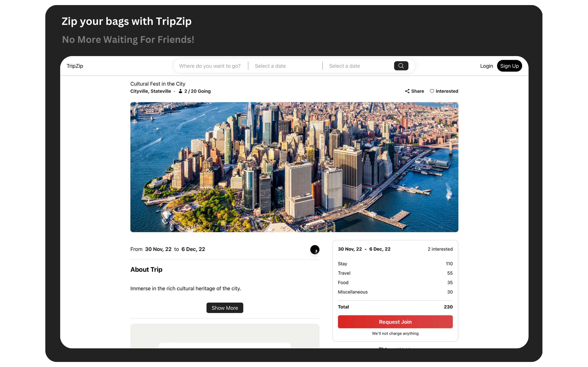
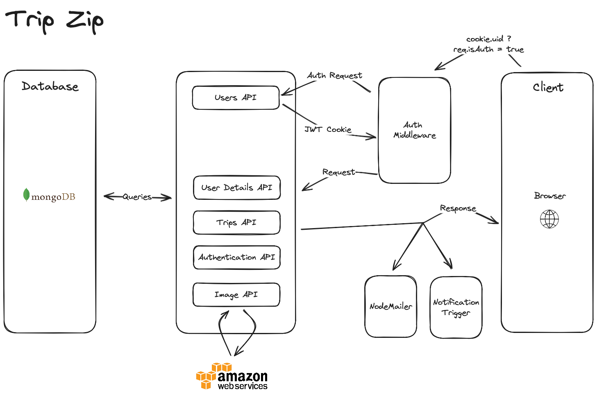

<div align="center">


#### The open-source platform for those who like to travel

[API Documentation](https://documenter.getpostman.com/view/16660574/2s9YR57axm) | [Guide](./SETUP_GUIDE.md)
</div>

<!-- <iframe width="560" height="315" src='https://dbdiagram.io/embed/650882a802bd1c4a5ecc62da'> </iframe> -->




## System Architecture

<div align="center">

</div>

</br>

The frontend and backend are deployed on render and you can deploy the same.

There are two seperate deployments with a monorepo structure with root folders as `frontend` and `backend`.

## Setup

To concurrently run from the root dir, use below command

```bash
  npm run start
```

In the backend folder, use below command to run server

```bash
  npm run dev
```

In the frontend folder, use below command to run server

```bash
  npm run start
```

## Server

### Request Status Codes

| Status Code              | Type          | Description             |
|--------------------------|---------------|-------------------------|
| `200 OK`                 | Success       | Contains Data           |
| `201 Created`            | Success       | Data Created            |
| `204 No Content`         | Success       | No Data Sent            |
| `400 Invalid Inputs`      | Error         | Invalid Inputs         |
| `401 Unauthorized`      | Error         | Unauthorized             |
| `404 Not Found`          | Error         | Data Not Found          |
| `500 Internal Server Error` | Error      | Internal Server Error   |

### Using Postman

We provide Postman collections to help you interact with our API. To get started:

1. [Download Postman](https://www.getpostman.com/downloads/) if you haven't already.
2. Visit the [Documentation](https://documenter.getpostman.com/view/16660574/2s9YR57axm) to run APIs locally or import json file from [Collection.json](/documentation/postman/postman-collection.json).
3. Configure the necessary environment variables (if applicable).
4. Start making requests!

<!-- 2. Import the relevant collection JSON file from the `documentation/postman` folder. -->
<!-- - [Collection 1](documentation/postman/Collection1.json)
- [Collection 2](documentation/postman/Collection2.json) -->

Please refer to the documentation for detailed usage instructions.

## License

This project is licensed under the [GNU AFFERO GENERAL PUBLIC LICENSE Version 3](LICENSE).

## Contributing

Please read [Contribution Guide](CONTRIBUTING.md) for details on our code of conduct, and the process for submitting pull requests to us.
